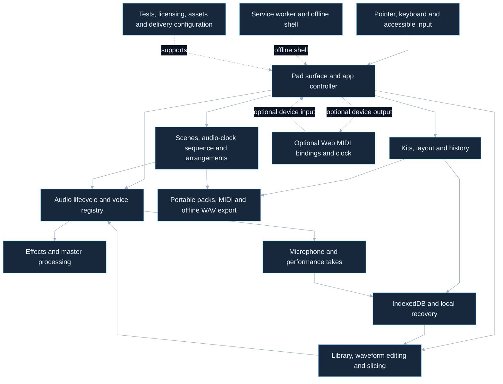

# Touchscreen Launchpad architecture

Browser inputs drive Web Audio pads, reusable local kits, sequencing, MIDI, recording and portable exports.

Snapshot: `eef62b01b9ff33d0ccf1c7fc7524eb00edf6ffbf`, verified through the GitHub connector on 2026-10-04.

## Boundaries and source differences

No application server, provider upload or cross-device sync is part of this browser flow. Downloaded neural stem separation and procedural demo-kit modules from the older local branch are absent here; offline WAV stem rendering is an existing export feature and is distinct from source separation. Permission, codec, device, IndexedDB and offline behavior require their own browser evidence. Preview tones remain available when no sample is assigned.

The [complete coverage register](coverage.md), [editable detailed diagram](detail.mmd) and [verification source map](verification.md) account for the pinned source. No application behavior, dependency, data or deployment changes are proposed. Prior local-only diagrams and Jev judgments are historical and are not transferred as approval of this snapshot.
