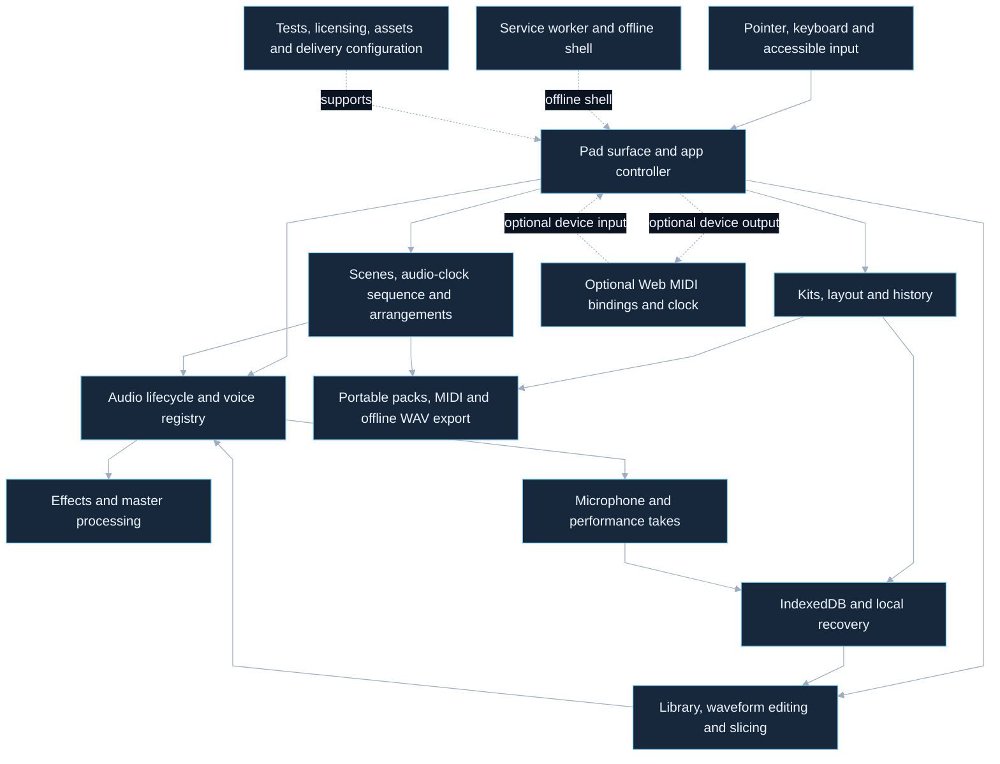

# Source coverage register

Snapshot: `eef62b01b9ff33d0ccf1c7fc7524eb00edf6ffbf`. Current hosted source; previous local snapshot `3ba22223efbaffe21deaaae65d6ffe0fd85bb78c` is historical.

## File accounting

70 tracked paths, assigned exactly once. Runtime clusters, tests, schema, assets and configuration are explicitly listed. This does not prove every execution path or dynamically loaded service.

### Assets, entry points and configuration

- `.github/workflows/pages.yml`
- `.gitignore`
- `CONTENT-LICENSES.md`
- `PROFESSIONAL-ROADMAP.md`
- `README.md`
- `TODO.md`
- `app.js`
- `icon.svg`
- `index.html`
- `manifest.webmanifest`
- `package-lock.json`
- `package.json`
- `robots.txt`
- `samples/.gitkeep`
- `samples/README.md`
- `scripts/validate-site.mjs`
- `sitemap.xml`
- `style.css`
- `sw.js`

### Documentation

- `docs/architecture/touchscreen-launchpad.mmd`
- `docs/architecture/touchscreen-launchpad.png`

### Runtime modules

- `src/arrangement.js`
- `src/audio-lifecycle.js`
- `src/bootstrap.js`
- `src/clocked-sequencer.js`
- `src/download.js`
- `src/effects.js`
- `src/history.js`
- `src/input-adapter.js`
- `src/midi-file.js`
- `src/midi.js`
- `src/migrations.js`
- `src/performance-engine.js`
- `src/performance-export.js`
- `src/pointer-state.js`
- `src/recording.js`
- `src/sample-editor.js`
- `src/sample-library.js`
- `src/sequencer.js`
- `src/slices.js`
- `src/storage-request.js`
- `src/storage/indexed-db.js`
- `src/storage/local-settings.js`
- `src/transport.js`
- `src/voice-registry.js`
- `src/wav.js`

### Tests

- `test/arrangement.test.mjs`
- `test/audio-lifecycle.test.mjs`
- `test/effects.test.mjs`
- `test/fixtures/storage-contract.mjs`
- `test/foundation.test.mjs`
- `test/import-export.test.mjs`
- `test/kit-library.test.mjs`
- `test/midi-file.test.mjs`
- `test/midi.test.mjs`
- `test/module-contract.test.mjs`
- `test/performance-engine.test.mjs`
- `test/performance-export.test.mjs`
- `test/pointer-lifecycle.test.mjs`
- `test/pwa.test.mjs`
- `test/recording.test.mjs`
- `test/sample-editor.test.mjs`
- `test/sample-library.test.mjs`
- `test/sequencer.test.mjs`
- `test/service-worker-runtime.test.mjs`
- `test/site-dom.test.mjs`
- `test/slices.test.mjs`
- `test/storage-recovery.test.mjs`
- `test/storage-repository.test.mjs`
- `test/wav.test.mjs`
