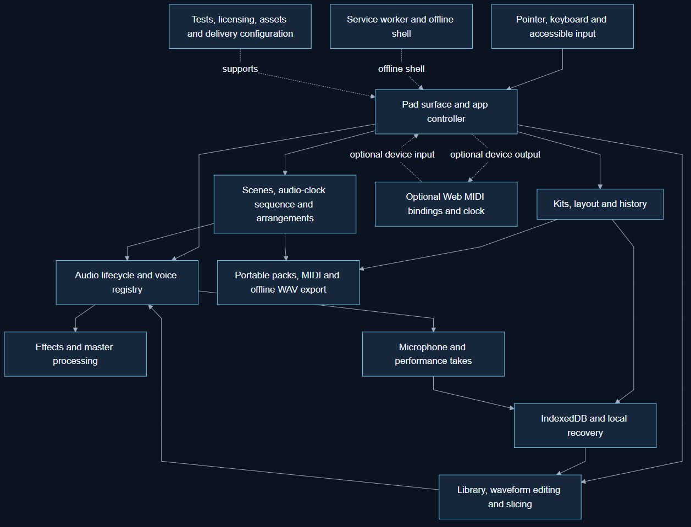

# Publication evidence

Source snapshot: `eef62b01b9ff33d0ccf1c7fc7524eb00edf6ffbf`. Publication parent: `eef62b01b9ff33d0ccf1c7fc7524eb00edf6ffbf`; target branch: `main`. The diagrams describe this pinned source snapshot, not all later application changes.

Editable Mermaid, full tracked inventory, source maps and a read-only checker are included. Current structural checks and source snapshot boundaries are separate from app runtime, hosted/provider and deployment proof. PNG previews are verified by rendering and byte hashes rather than Jev binary review.

The user authorized feature-branch commits, push and PR publication on 2026-10-04. Original unrelated edits and local application commits are preserved and excluded from these documentation commits. No merge or deployment is authorized. Observed Jev model: jev-1.13.0. 9 text files were covered by a complete-diff call, without text exclusions or truncation. All observed outcomes were no_clear_issue, but every gate remains resolve_findings_or_human_review. Exact typed results and non-empty usage are saved in [review.json](review.json). This generated receipt records the preceding source/documentation review; no green approval is claimed.
